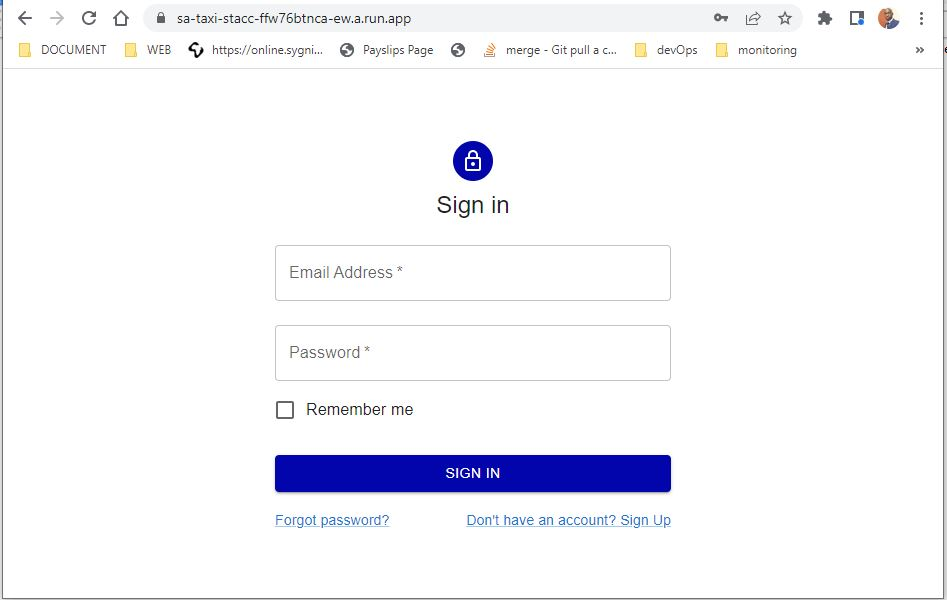
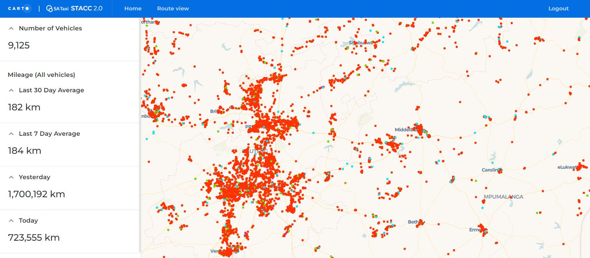
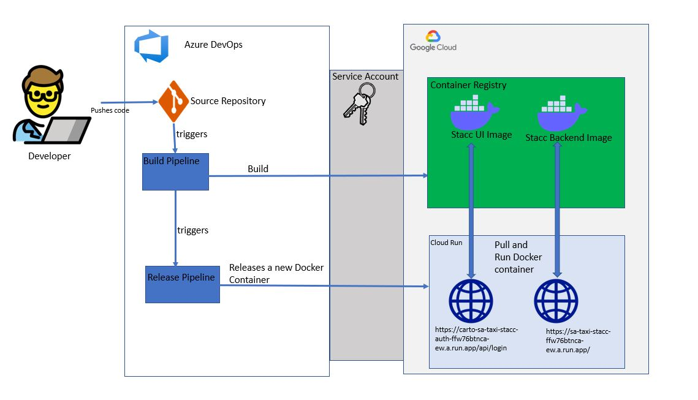
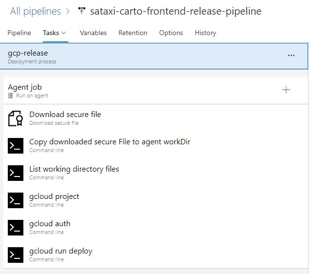

# CARTO for STACC

Skeleton Template for CARTO Cloud

Welcome to CARTO for React! The best way to develop Location Intelligence Apps using CARTO Cloud Native platform + deck.gl. It will provide you a well designed structure following the best practices for modern frontend development and an integrated toolchain for testing, building and deploying your application.


# Getting Started.
This project can run locally i.e. on your machine or deployed via a docker container. the steps below are meant to help you get the app running on your local machine.
#  Running the project
## Local Machine.
### System Prerequisites
- nodejs can be found [node](https://nodejs.org/en/) useful [steps](https://phoenixnap.com/kb/install-node-js-npm-on-windows)
  
- git installation steps [here](https://git-scm.com/downloads)
- [yarn](https://classic.yarnpkg.com/lang/en/docs/install/#windows-stable) or npm package manager
---
### project specific prerequisites will be install using npm or yarn depending on your preference
using a terminal editor of your choice
clone the repo: `git clone https://SATAXIBI@dev.azure.com/SATAXIBI/STACC%202.0/_git/STACC%202.0` this will clone the app into your machine in file STACC 2.0
navigate into the cloned repo `cd STACC 2.0` and run:
1. `npm install or yarn install` this will create node_modules folder and install all required packages.
2. once the install has finished successfully run `npm start $env` 
   replacing the $env with your env target there is .env.development this will force the app to target the development file and make the hosts for both apps to be localhost or 127.0.0.1.
   Please note that if you don't specify which .env file to use the application will by defualt be pointing to the live environment.
3. The app should open a browser and you should be able to visit the urls.
4. Available Views:
## Login

## Current Location

more views [here](src/assets/readme_files/)
# Azure devOps Architecture


---
 - Azure Pipelines

   - As the devloper pushes the code into the repository an automated build pipeline is then triggered based on [pipeline-config](azure-pipelines.yml):
   - it then builds the docker image based on the specifications inside the [Dockerfile](Dockerfile)
   - when the build succeeeds a release pipeline is triggered  

 - Release Pipelines
   this pipeline is used to pull the image from [google-container-registry](https://console.cloud.google.com/gcr/images/sa-taxi-edw?project=sa-taxi-edw)

   - [backend](https://console.cloud.google.com/gcr/images/sa-taxi-edw/global/auth-api?project=sa-taxi-edw)
   - [frontend](https://console.cloud.google.com/gcr/images/sa-taxi-edw/global/carto-react-docker?project=sa-taxi-edw)

 - It then re-deploys the container in google-cloud cloud run
 [frontend](https://sa-taxi-stacc-ffw76btnca-ew.a.run.app/). or [backend](https://carto-sa-taxi-stacc-auth-ffw76btnca-ew.a.run.app) depending on which repo you working on.

 #  Configuration of the pipeline

   - the configuration consists of gcloud commands so it is important to ensure your worker machine has google-cloud-sdk installed.(azure DevOps installs this by default on its agents)
   - You will need to create a new service connection in your azure devops project settings. the service connection will consist of the gcp service account keys.
   you can see how to do this [here](https://medium.com/@truble/connect-azure-pipelines-to-gcp-921d31b6303c)
The screenshot below shows the steps that gets executed during the release
 
 ##
 ## steps and commands executed
 ```
  #first task downloads the secure file 
  #copy the secure file into your workdir
  cp $(sakey.secureFilePath) $(System.DefaultWorkingDirectory)/_STACC\ 2.0/sa-key.json
  #Set Gcloud Project
  gcloud config set project sa-taxi-edw
  #Authenticate into GCP
  gcloud auth activate-service-account --key-file $(sakey.secureFilePath)
  #deploy the app
  gcloud run deploy sa-taxi-stacc --image gcr.io/sa-taxi-edw/carto-react-docker:latest --region=europe-west1 --quiet --port=80 --allow-unauthenticated
 ```

 > # Opportunities

 [^1]: The token based auth can be changed into using rest_framework auth-token
 [^2]: More better user experience specific styling can be added.
 [^3]: The change into a more rest_framework token based auth could eliminate the use of Cookies.