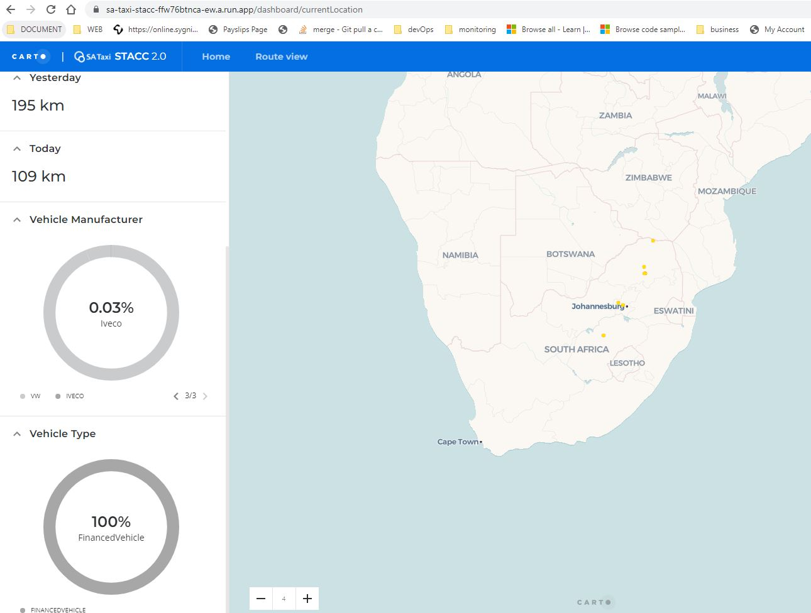
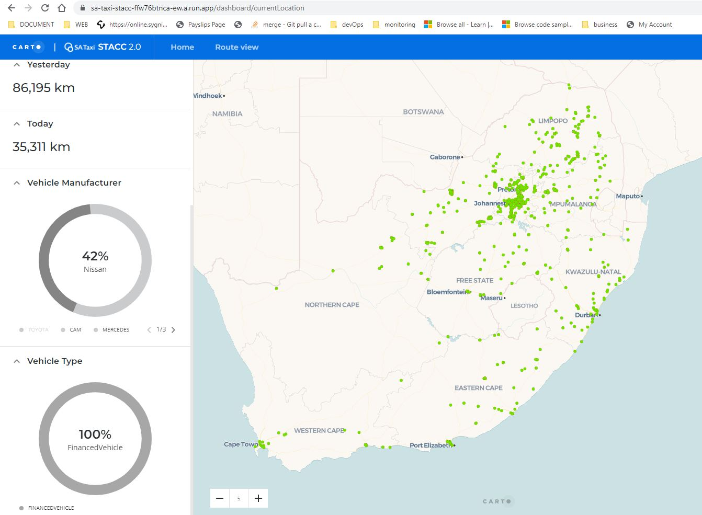

# CARTO for STACC

Skeleton Template for CARTO Cloud

Welcome to CARTO for React! The best way to develop Location Intelligence Apps using CARTO Cloud Native platform + deck.gl. It will provide you a well designed structure following the best practices for modern frontend development and an integrated toolchain for testing, building and deploying your application.

# Getting Started.
This project can run locally i.e. on your machine or deployed via a docker container. the steps below are meant to help you get the app running on your local machine and also deploying it using Azure DevOps.
#  Running the project
## Local Machine.
### System Prerequisites
- nodejs can be found [node](https://nodejs.org/en/) useful [steps](https://phoenixnap.com/kb/install-node-js-npm-on-windows)
  
- git installation steps [here](https://git-scm.com/downloads)
- [yarn](https://classic.yarnpkg.com/lang/en/docs/install/#windows-stable) or npm package manager

### project specific prerequisites will be install using npm or yarn depending on your preference
using a terminal editor of your choice
clone the repo: `git clone https://SATAXIBI@dev.azure.com/SATAXIBI/STACC%202.0/_git/STACC%202.0` this will clone the app into your machine in file STACC 2.0
navigate into the cloned repo `cd STACC 2.0` and run:
1. `npm install or yarn install` this will create node_modules folder and install all required packages.
2. once the install has finished successfully run `npm start $env` 
   replacing the $env with your env target there is .env.development this will force the app to target the development file and make the hosts for both apps to be localhost or 127.0.0.1.
   Please note that if you don't specify which .env file to use the application will by defualt be pointing to the live environment.
3. The app should open a browser and you should be able to visit the urls.
4. Available Views:
## Login

## Current Location

## Current Location filter vehicle

## Current Location ToolTip

## Mercedes filter

## Iveco Filter

## Nissan Filter

## Open Market Toyota

## Route View

## Search Bar

## Date filter

## Route Aggregates

## RouteToolTip

# Azure devOps Architecture

 - Azure Pipelines
 - Release Pipelines

